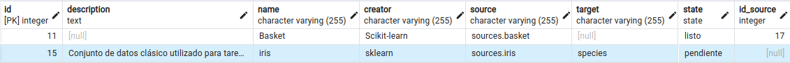
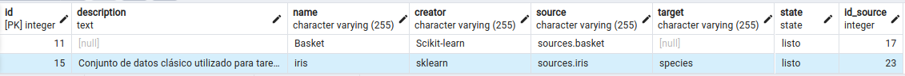
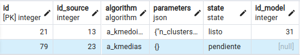
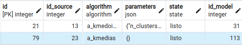
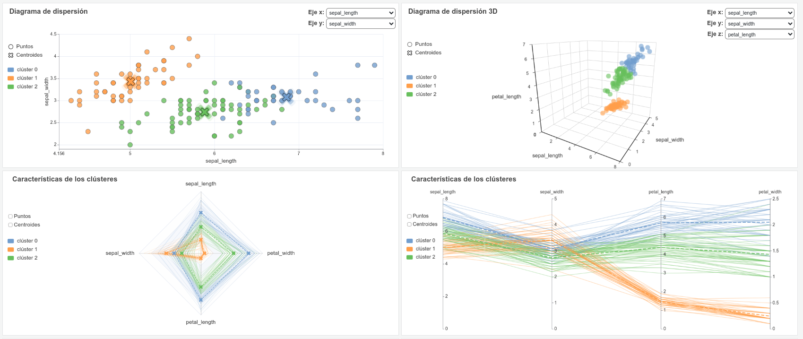

# 📊 Visualización de modelos de aprendizaje automático en Grafana

Este proyecto tiene como objetivo visualizar modelos de aprendizaje automático en Grafana, aprovechando el poder de extensiones como **Business Charts** para crear paneles interactivos. Se han desarrollado visualizaciones para representar los siguientes tipos de modelos:

- Agrupamiento K-medias - K-medoides
- Agrupamiento jerárquico
- Regresión lineal
- Regresión logística
- Correlación Pearson - Spearman
- Árboles de decisión
- Reglas de asociación

Los modelos son entrenados en Python, se almacenan en una base de datos relacional PostgreSQL, y luego son obtenidos desde Grafana mediante consultas SQL para su visualización. La interacción con el usuario se realiza mediante un sistema de gestión de tareas, que permite crear y eliminar modelos, así como administrar las fuentes de datos utilizadas para el entrenamiento.

## 🛠️ Tecnologías utilizadas
- **Python**: para la ejecución de los algoritmos y el procesamiento.
- **PostgreSQL**: para almacenar fuentes de datos y modelos.
- **Grafana + Business Charts + Business Text**: para visualizar los modelos.

## 📦 Instalación

1\. Clonar el repositorio del proyecto 
```bash
git clone https://github.com/KDC-Grafana/grafana-ml-visualization.git
```

2\. Acceder a la carpeta del proyecto
```bash
cd grafana-ml-visualization
```

3\. Crear un entorno virtual de Python (recomendado)
```bash
python -m venv venv
```

4\. Activar el entorno virtual

Linux:
```bash
source venv/bin/activate
```
Windows:
```bash
.\venv\Scripts\activate
```

5\. Instalar todas las dependencias necesarias
```bash
pip install -r requirements.txt
```

6\. Cargar los paneles en Grafana

Para importar los paneles debe:
- Acceder a tu instancia de Grafana (por defecto: http://localhost:3000).
- En el menú lateral, ve a `Dashboards` > `New` > `Import`.
- Haz clic en `Upload dashboar JSON file`.
- Seleccionar el archivo JSON desde la carpeta `panels`.
- Haz clic en `Import`.

>📌 Una vez importado el panel, es importante establecer la conexión con la base de datos PostgreSQL desde Grafana (Connections > Add new connection > PostgreSQL).

## ⚙️ Configuración 
El archivo `conf.ini` se encuentra en la carpeta `config` y contiene los parámetros necesarios para conectar con la base de datos y controlar algunas funcionalidades del sistema.

### Estructura del archivo
```ini
[database]
dbname = grafana_ml_models       # Nombre de la base de datos en PostgreSQL
user = postgres                  # Usuario con permisos para acceder a la base de datos
password = postgres              # Contraseña del usuario especificado
host = localhost                 # Dirección del servidor de base de datos (localhost si es local)
port = 5432                      # Puerto de conexión de PostgreSQL (5432 por defecto)

[scheduler]
interval_minutes = 1            # Intervalo en minutos para revisar y ejecutar tareas pendientes

[features]
task_notifications = true       # Habilita notificaciones para cada tarea
general_notifications = false   # Habilita notificaciones generales por ejecución
generate_summary = true         # Habilita la creación de un resumen por ejecución con IDs y posibles errores detectados
```

## ▶️ Ejecución

### Linux
**Comandos disponibles:**
```bash
python main_linux.py create
```
Programa la ejecución automática del sistema cada N minutos (según el valor en `config/conf.ini` > `[scheduler] interval_minutes`).
```bash
python main_linux.py delete
```
Elimina la programación automática.

> 📌 Una vez creado, el cron ejecuta el programa de forma recurrente, incluso si la computadora se reinicia.

### Windows
Primeramente, se debe ejecutar el archivo `main_windows.py`.

Al hacerlo, se mostrará una ventana emergente con el mensaje:
> ¿Desea ejecutar el servicio GrafanaML?

- ✅ Si haces clic en **"Sí"**, el servicio se inicia y comienza a procesar tareas automáticamente.
- ❌ Si haces clic en **"No"**, el programa se cierra sin ejecutar ningún proceso.

> 📌 Una vez iniciado el servicio por primera vez, no será necesario volver a entrar al IDE. Cada vez que se inicie el sistema operativo aparecerá la ventana emergente con el mensaje.

Para detener el programa, presionar la combinación:
```
Ctrl + Shift + Q
```
Al hacerlo, el sistema mostrará una ventana emergente:
> ¿Desea detener el servicio GrafanaML?

- ✅ Si haces clic en **"Sí"**, el servicio se detiene de forma segura y se cierra completamente.
- ❌ Si haces clic en **"No"**, el servicio continuará ejecutándose.

## 📝 Ejemplos de uso

### Insertar fuente de datos

Para agregar una nueva fuente de datos, se debe insertar una tarea en la tabla `grafana_ml_model_source_create`, indicando la siguiente información:

- **Nombre**: nombre del conjunto de datos.
- **Descripción** *(opcional)* : breve descripción del conjunto de datos.
- **Creador** *(opcional)* : nombre del autor.
- **Source**: ubicación del conjunto de datos en la base de datos. Formato requerido: `esquema.tabla` o `esquema.vista`.
- **Target** *(condicional)* : variable objetivo necesaria si el algoritmo a ejecutar lo requiere (por ejemplo, en modelos supervisados).

> 📌 Una vez que una fuente de datos ha sido insertada, puede reutilizarse para crear tantos modelos como se desee, sin necesidad de volver a insertarla.

#### Ejemplo

A continuación, se muestra un ejemplo para el conjunto de datos *Iris*, ubicado en el esquema `sources` y la tabla `iris`:

```sql
INSERT INTO grafana_ml_model_source_create (description, name, creator, source, target)
VALUES (
    'Conjunto de datos clásico utilizado para tareas de clasificación y agrupamiento. Incluye medidas de sépalos y pétalos de tres especies de Iris.',
    'iris',
    'sklearn',
    'sources.iris',
    'species'
);
```

> 📌 **Nota**:  
> El campo `state` se establece automáticamente en `'pendiente'` al crear la tarea. Luego pasa a `'en_ejecucion'` cuando ha comenzado a procesarse.
>  
> Posteriormente puede tomar uno de los siguientes valores:
> - `'listo'`: si el modelo se genera correctamente.
> - `'ejecucion_fallida'`: si ocurre un error durante la ejecución.
>  
> El campo `id_source` se actualiza automáticamente con el identificador del modelo generado,  
> solo cuando el estado cambia a `'listo'`.

Las siguientes figuras muestran la tarea registrada en la base de datos, primero con estado `'pendiente'` y luego con estado `'listo'`, junto con el identificador (`'id_source'`) de la nueva fuente creada.

<p align="center">
  
</p>


<p align="center">
  
</p>


### Crear modelo

Para crear un modelo, se debe insertar una tarea en la tabla `grafana_ml_model_task_create`, indicando la siguiente información:

- **Identificador de la fuente de datos**: identificador del conjunto de datos que será procesado por el algoritmo de aprendizaje automático.

- **Algoritmo**: debe ser una de las siguientes opciones:
  - `a_kmedias`
  - `a_kmedoides`
  - `a_jerarquico`
  - `c_pearson`
  - `c_spearman`
  - `r_lineal`
  - `r_logistica`
  - `arbol_decision`
  - `reglas_asociacion`

- **Parámetros** *(opcional)* : en formato JSON. Si no se especifican, se usarán los valores por defecto.  
  Para correlación y regresión, no es necesario especificar parámetros.


#### Parámetros

- Parámetros por defecto para K-medias (`a_kmedias`)

    ```jsonc
    {
    "n_clusters": 3,
    "init": "k-means++",     // "k-means++", "random"
    "algorithm": "lloyd",    // "lloyd", "elkan"
    "n_init": "auto"         // "auto" o un entero positivo
    }
    ```

- Parámetros por defecto para K-medoides (`a_kmedoides`)

    ```jsonc
    {
    "n_clusters": 3,
    "metric": "euclidean",   // "euclidean", "manhattan", "cosine", "l1", "l2"
    "method": "alternate",   // "alternate", "pam"
    "init": "k-medoids++"    // "random", "heuristic", "k-medoids++"
    }
    ```

- Parámetros por defecto para agrupamiento jerárquico (`a_jerarquico`)

    ```jsonc
    {
    "metric": "euclidean",   // "euclidean", "manhattan", "cosine", "l1", "l2"
    "method": "ward"         //  "ward" (solo con metric="euclidean"), "complete", "average", "single"
    }
    ```

- Parámetros por defecto para árboles de decisión (`arbol_decision`)

    ```jsonc
    {
    "max_depth": null,           // entero positivo mayor que 1 o null (sin límite)
    "class_weight": null         // dict, lista de dicts o "balanced"
    }
    ```

- Parámetros por defecto para reglas de asociación (`reglas_asociacion`)

    ```jsonc
    {
    "min_support": 0.1,          // número real entre 0 y 1
    "min_confidence": 0.7        // número real entre 0 y 1
    }
    ```

#### Ejemplo

A continuación, se muestra un ejemplo de cómo insertar una tarea para crear un modelo de K-medias (`a_kmedias`) sobre la fuente de datos registrada anteriormente (`id_source = 23`):

```sql
INSERT INTO grafana_ml_model_task_create (id_source, algorithm)
VALUES (
    23, 'a_kmedias'
);
```

> 📌 **Nota**:  
> Los campos `state` e `id_model`se gestionan automáticamente por el sistema como ha sido explicado anteriormente.


Las siguientes figuras muestran la tarea registrada en la base de datos, primero con estado `'pendiente'` y luego con estado `'listo'`, junto con el identificador (`'id_model'`) del nuevo modelo creado.

<p align="center">
  
</p>


<p align="center">
  
</p>

### Visualizar resultados en Grafana

Una vez que el modelo alcanza el estado `'listo'`, puede visualizarse directamente en Grafana. Para ello, se debe seleccionar el identificador del modelo generado en la variable correspondiente del panel.

A continuación, se presentan algunas de las visualizaciones disponibles.

<p align="center">
  
</p>

> 📌 Se han definido una serie de variables de Grafana que permiten personalizar ciertos elementos gráficos, como los símbolos utilizados y la paleta de colores.

### Eliminar modelo

Para eliminar un modelo, se debe insertar una tarea en la tabla `grafana_ml_model_task_delete`, indicando el id del modelo que desea eliminar.

```sql
INSERT INTO grafana_ml_model_task_delete (id_model)
VALUES (113);
```

### Eliminar fuente de datos

Para eliminar un modelo, se debe insertar una tarea en la tabla `grafana_ml_model_source_delete`, indicando el id de la fuente de datos que desea eliminar. 

> ⚠️ La eliminación solo se realiza si la fuente **no está asociada a ningún modelo existente**.

```sql
INSERT INTO grafana_ml_model_source_delete (id_source)
VALUES (23);
```